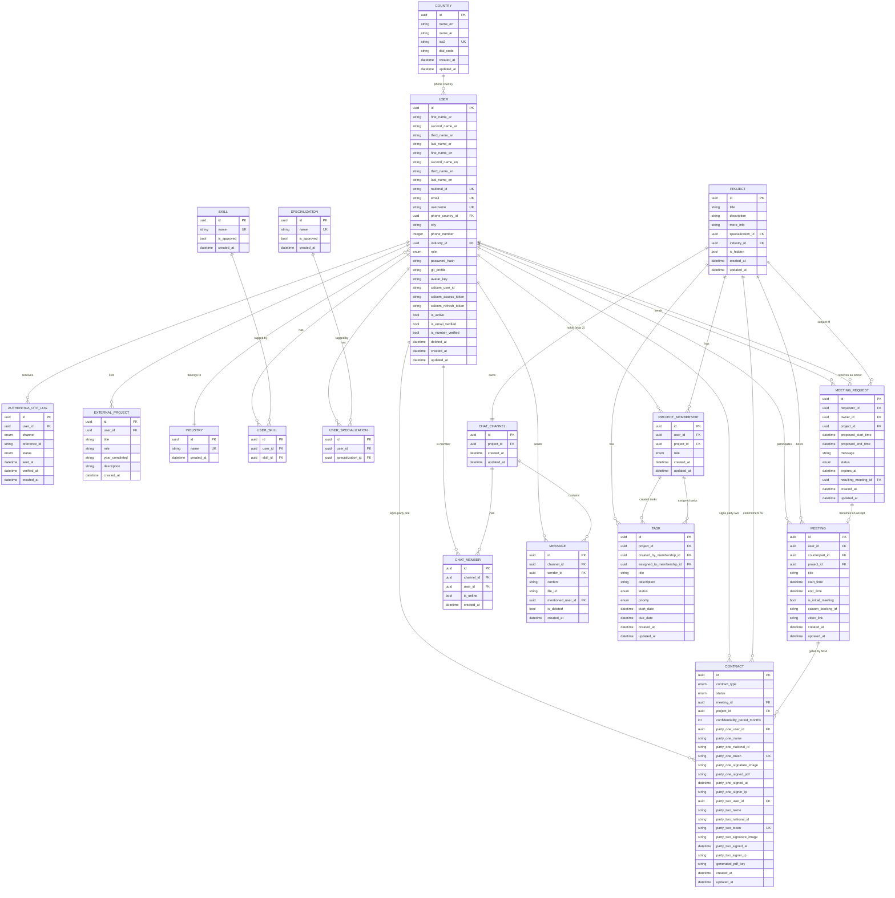

# User Stories - MoSCoW Classification

## 1. Must Have

### Idea Owner

- As an idea owner, I want to register, so that I get the right experience from the start.
- As an idea owner, I want to post my idea with a description and required skills, so that I can attract the right team members.
- As an idea owner, I want to review and accept or reject join requests, so that I can control who joins my team.
- As an idea owner, I want an NDA to be auto generated upon accepting a request, so that my idea is legally protected before any discussion.
- As an idea owner, I want to schedule a meeting after the NDA is signed, so that I can discuss the project with the candidate.
- As an idea owner, I want the listing to be hidden once the team is complete, so that no further requests come in.

### Talent Provider

- As a talent provider, I want to register, so that I get the right experience from the start.
- As a talent provider, I want to browse and filter ideas by skill or category, so that I can find relevant projects.
- As a talent provider, I want to send a join request with a message, so that I can apply to a project.
- As a talent provider, I want to sign the NDA digitally before the meeting, so that I can proceed with full awareness of my obligations.

## 2. Should Have

### Idea Owner

- As an idea owner, I want a dashboard with tasks, progress tracking, and attendance monitoring, so that I can manage the project from one place.
- As an idea owner, I want to upload and organize project files in a studio, so that all assets are centralized.

### Talent Provider

- As a talent provider, I want to build a profile with my skills, specialization, and past projects, so that idea owners can evaluate my fitness.
- As a talent provider, I want access to recordings and direct messaging within the project, so that I can collaborate effectively.

## 3. Could Have

### Idea Owner

- As an idea owner, I want a shortcut to a partner law office, so that I can formalize contracts without searching externally.
- As an idea owner, I want an integrated calendar view, so that I have a full picture of the project timeline.

### Talent Provider

- As a talent provider, I want to specify my preferred work domain on my profile, so that relevant ideas are surfaced to me.
- As a talent provider, I want an integrated calendar view, so that I can plan my time effectively.

## 4. Won't Have (Now)

### Idea Owner

- As an idea owner, I want to participate in hackathons and access advanced subscription plans, so that I can unlock more platform capabilities.

### Talent Provider

- As a talent provider, I want a skill-based recommendation engine and access to hackathons, so that I can discover projects and challenges faster.

-----
Add Live chat - Add Sign system api

## 1. Design System Architecture

### Project Name

**Bayn – بين**

### Purpose

The purpose of this section is to define the high-level system architecture of Bayn MVP and explain how the main components interact with each other. The architecture shows the frontend, backend, database, storage, external services, and data flow between them.

---

## High-Level Architecture Diagram

```text
                                    ┌────────────────────┐
                                    │       Users        │
                                    │ Idea Owners & Teams│
                                    └─────────┬──────────┘
                                              │
                                              │ Interact with platform
                                              ▼
                                    ┌────────────────────┐
                                    │  Frontend (React)  │
                                    │ Web & Dashboard UI │
                                    └─────────┬──────────┘
                                              │
                                              │ HTTPS API Requests
                                              ▼
┌──────────────────────────────────────────────────────────────────────────────┐
│                           Backend API (FastAPI)                              │
│                                                                              │
│ Authentication • Verification • Permissions • Projects • Contracts • Meetings│
│ Collaboration Requests • Dashboard Data • Notifications                      │
└──────┬──────────────┬──────────────┬──────────────┬──────────────┬───────────┘
       |              │              │              │              │
       |  SQL Queries │ File Uploads │ API Calls    │ API Calls    │ Email/OTP
       |              ▼              ▼              ▼              ▼
       |        ┌────────────┐ ┌────────────┐ ┌────────────┐ ┌────────────┐
       |        │Cloudflare  │ │  Cal.com   │ │  Daily.co  │ │ SMTP       │
       |        │    R2      │ │ Scheduling │ │ Meetings   │ │ Email      │
       |        └─────┬──────┘ └─────┬──────┘ └─────┬──────┘ └────────────┘
       │              │              │              │
       │ Metadata     │ Contracts    │ Meeting      │ Meeting Rooms
       │              │ Files &      │ Scheduling   │ Recordings
       │              │ Uploads      │              │ & Archive
       │              │              │              ▼
       │              │              │      ┌────────────────┐
       │              │              │      │ Cloudflare R2  │
       │              │              │      │  Recording &   │
       │              │              │      │  Archive Store │
       │              │              │      └───────┬────────┘
       │              │              │              │
       └──────────────┴──────────────┴──────────────┘
                              │
                              │ Metadata / URLs
                              ▼
                        ┌──────────────┐
                        │ PostgreSQL   │
                        │ Database     │
                        └──────────────┘
```

---

## Main System Components

| Component                     | Technology                                             | Responsibility                                                                                                                                                            |
| ----------------------------- | ------------------------------------------------------ | ------------------------------------------------------------------------------------------------------------------------------------------------------------------------- |
| Frontend                      | React                                                  | Provides the user interface, dashboard, forms, project pages, contract pages, meeting pages, and progress tracking views                                                  |
| Backend API                   | FastAPI                                                | Handles business logic, API requests, authentication, verification, permissions, projects, collaboration requests, contracts, meetings, dashboard data, and notifications |
| Database                      | PostgreSQL                                             | Stores users, ideas, collaboration requests, contracts metadata, meeting metadata, permissions, recordings metadata, and progress tracking data                           |
| Authentication & Verification | Email/Password + Email Verification + SMS Verification | Allows users to register, login, and verify their accounts using email verification and SMS verification                                                                  |
| File Storage                  | Cloudflare R2                                          | Stores uploaded files, contracts, and meeting recordings with secure access, versioning, and CDN delivery                                                                |
| Scheduling Service            | Cal.com                                                | Handles meeting scheduling, booking links, and meeting time organization                                                                                                  |
| Meeting Service               | Daily.co                                               | Creates and manages meeting rooms inside the platform based on user permissions with automatic recording integration                                                    |
| Recording Storage & Archive   | Cloudflare R2                                          | Stores and archives meeting recordings, provides recording links, metadata, and secure access control with automatic cleanup policies                                    |
| Email Service                 | Gmail SMTP                                             | Sends verification emails, OTP messages, notifications, and system emails                                                                                                 |

---

## Data Flow Explanation

### 1. User Registration and Verification Flow

The user registers through the React frontend. The frontend sends the registration data to the FastAPI backend through an HTTPS API request. The backend stores the user information in PostgreSQL and starts the verification process using email verification and SMS verification.

```text
User
  → React Frontend
  → FastAPI Backend
  → PostgreSQL Database

FastAPI Backend
  ├→ SMTP → Email Verification
  └→ SMS Verification Service → OTP Verification
```

---

### 2. Login Flow

The user enters their email and password in the React frontend. The frontend sends the credentials to the FastAPI backend. The backend validates the credentials against PostgreSQL and checks whether the user account is verified before allowing access to the platform.

```text
User
  → React Frontend
  → FastAPI Backend
  → PostgreSQL Database
  → FastAPI Backend
  → React Frontend
```

---

### 3. Project and Collaboration Flow

Users can publish ideas, search for members, send collaboration requests, and accept requests. These actions are sent from the React frontend to the FastAPI backend. The backend validates the request, checks permissions when needed, and stores the data in PostgreSQL.

```text
User
  → React Frontend
  → FastAPI Backend
  → PostgreSQL Database
```

Main actions included in this flow:

* Publish idea
* Search for members
* Send collaboration request
* Accept collaboration request
* Update project progress

---

### 4. Contracts and Files Flow

When a user uploads or creates a contract, the frontend sends the file to the FastAPI backend. The backend stores the actual contract or uploaded file in Cloudflare R2. The contract metadata, such as file name, owner, project ID, upload date, and file URL, is stored in PostgreSQL.

```text
React Frontend
  → FastAPI Backend
  ├→ Cloudflare R2
  └→ PostgreSQL Database
```

---

### 5. Meeting Scheduling Flow

Meetings are scheduled inside the platform using Cal.com. The user sends a scheduling request from the React frontend. The FastAPI backend checks the user permissions, communicates with Cal.com to schedule the meeting, and stores the meeting schedule information in PostgreSQL.

```text
React Frontend
  → FastAPI Backend
  → Permission Check
  ├→ Cal.com API
  └→ PostgreSQL Database
```

---

### 6. Meeting Room Flow

After the meeting is scheduled, the FastAPI backend creates or manages the meeting room using Daily.co. Only authorized team members can access the meeting based on their permissions.

```text
React Frontend
  → FastAPI Backend
  → Permission Check
  → Daily.co API
  → React Frontend
```

---

### 7. Meeting Recording Flow

Meeting recordings are automatically captured by Daily.co and stored in Cloudflare R2. After the recording is generated, the recording URL, metadata, and access controls are saved in PostgreSQL. The dashboard can later display the recording to authorized users with secure signed URLs.

```text
Daily.co Recording
  → Cloudflare R2
  → PostgreSQL Database (metadata & signed URLs)
  → FastAPI Backend
  → React Frontend Dashboard
```

---

### 8. Email Notification Flow

The FastAPI backend uses Gmail SMTP to send verification emails, OTP messages, meeting notifications, collaboration request updates, and system notifications.

```text
FastAPI Backend
  → Gmail SMTP
  → User Email
```

---

### 9. Dashboard and Progress Tracking Flow

The dashboard retrieves data related to projects, team members, collaboration requests, contracts, meetings, recordings, and progress tracking. The React frontend sends a request to the FastAPI backend, and the backend fetches the required data from PostgreSQL.

```text
React Frontend
  → FastAPI Backend
  → PostgreSQL Database
  → FastAPI Backend
  → React Frontend Dashboard
```

---

## Scalability and Efficiency

The architecture separates the system into independent components: frontend, backend, database, storage, scheduling, meetings, email, and recording storage. This separation makes the MVP easier to maintain, test, and scale in the future.

React is used to build a flexible and responsive user interface. FastAPI is used as a lightweight backend API for handling business logic and integrations. PostgreSQL provides reliable structured storage for users, projects, contracts, meetings, and dashboard data. Cal.com is used for scheduling meetings, while Daily.co is used for creating and managing meeting rooms. Cloudflare R2 provides scalable object storage for all user-uploaded files, contracts, and meeting recordings with CDN delivery, automatic versioning, and secure access control capabilities.

----
## Components, Classes, and Database Design
 
### Backend Classes by Feature
 
#### identity
| Class | Type | Key Attributes |
|---|---|---|
| `User` | Model | id, first/second/third/last_name_ar, first/second/third/last_name_en, national_id (UK), email (UK), username (UK), phone_country_id (FK), phone_number, industry_id (FK), role, password_hash, avatar_key, calcom_user_id/access_token/refresh_token, is_active, is_email_verified, is_number_verified, deleted_at |
| `UserRole` | Enum | ADMIN \| USER — platform-wide only |
| `ExternalProject` | Model | id, user_id (FK), title, role, year_completed, description, project_url |
| `UserCreate / UserLogin / UserUpdate` | Pydantic schemas | Request payload validation |
| `UserResponse / TokenResponse` | Pydantic schemas | Output — never exposes password_hash or tokens |
| `get_current_user() → get_current_active_user() → require_admin()` | Dependencies | Chained JWT guards — checks deleted_at, is_active, is_email_verified in order |
 
#### catalog
| Class | Type | Key Attributes |
|---|---|---|
| `Country` | Model | id, name_en, name_ar, iso2 (UK), dial_code — pre-seeded |
| `Skill / Specialization` | Model | id, name (UK), is_approved |
| `Industry` | Model | id, name (UK) |
| `UserSkill / UserSpecialization` | Model (join tables) | id, user_id (FK), skill_id / specialization_id (FK) |
 
#### projects
| Class | Type | Key Attributes |
|---|---|---|
| `Project` | Model | id, title, description, more_info, specialization_id (FK), industry_id (FK), is_hidden |
| `ProjectMembership` | Model | id, user_id (FK), project_id (FK), role (OWNER \| MEMBER) |
| `ProjectRole` | Enum | OWNER \| MEMBER — per-project, separate from UserRole |
 
#### meetings
| Class | Type | Key Attributes |
|---|---|---|
| `MeetingRequest` | Model | id, requester_id (FK), owner_id (FK), project_id (FK), proposed_start_time, proposed_end_time, message, status, expires_at, resulting_meeting_id (FK) |
| `MeetingRequestStatus` | Enum | PENDING \| ACCEPTED \| REJECTED \| CANCELLED \| EXPIRED |
| `Meeting` | Model | id, user_id (FK), counterpart_id (FK), project_id (FK), title, start_time, end_time, is_initial_meeting, calcom_booking_id, video_link |
| `MeetingAttendance` | Model | id, meeting_id (FK), membership_id (FK), status (present \| absent \| late), joined_at, left_at |
 
#### contracts
| Class | Type | Key Attributes |
|---|---|---|
| `Contract` | Model | id, contract_type, status, meeting_id (FK), project_id (FK), confidentiality_period_months, party_one_user_id (FK), party_one_name, party_one_national_id, party_one_token (UK), party_one_signature_image, party_one_signed_pdf, party_one_signed_at, party_one_signer_ip, party_two_*(same set), generated_pdf_key |
| `ContractStatus` | Enum | PENDING_PARTY_ONE → PENDING_PARTY_TWO → SIGNED \| EXPIRED |
| `ContractType` | Enum | NDA \| COMMITMENT |
 
#### livechat
| Class | Type | Key Attributes |
|---|---|---|
| `ChatChannel` | Model | id, project_id (FK, unique), created_at — one channel per project |
| `ChatMember` | Model | id, channel_id (FK), user_id (FK), is_online |
| `Message` | Model | id, channel_id (FK), sender_id (FK), content, file_url, mentioned_user_id (FK), created_at |
 
#### tasks
| Class | Type | Key Attributes |
|---|---|---|
| `Task` | Model | id, project_id (FK), created_by_membership_id (FK), assigned_to_membership_id (FK), title, description, status, priority, start_date, due_date |
| `TaskStatus` | Enum | TODO \| IN_PROGRESS \| DONE |
| `TaskPriority` | Enum | LOW \| MEDIUM \| HIGH |
 
---
 
### Database Schema Reference
 
All tables use a UUID primary key and inherit `created_at` / `updated_at` from `BaseMixin`.
 
| Table | Feature | Purpose |
|---|---|---|
| `users` | identity | Core account record |
| `authentica_otp_log` | identity | OTP request log (reference_id from Authentica) |
| `external_projects` | identity | Self-reported off-platform project history |
| `countries` | catalog | Pre-seeded country reference (iso2, dial_code) |
| `skills / specializations` | catalog | User-extensible reference banks |
| `industries` | catalog | Industry reference (one per user via FK) |
| `user_skills / user_specializations` | catalog | Many-to-many join tables |
| `projects` | projects | Project listings |
| `project_memberships` | projects | User ↔ Project with role (max 2 active per user) |
| `meeting_requests` | meetings | Pre-join negotiation (Talent → Owner) |
| `meetings` | meetings | Confirmed Cal.com bookings with Daily.co room links |
| `meeting_attendance` | meetings | Presence record per member per meeting |
| `contracts` | contracts | NDA / Commitment — two-stage signing flow |
| `chat_channels` | livechat | One channel per project (created on project creation) |
| `chat_members` | livechat | Channel membership (mirrors project_memberships) |
| `messages` | livechat | Full message storage (text + file_url) |
| `tasks` | tasks | Project tasks with status, priority, and due dates |
| `project_files` | documents | Organized file storage per project |
 
---
 
 
## Database Schema — Entity-Relationship Diagram



 
----

# task 3

----
# API Specifications

## External APIs

integrates four external services. All credentials are stored in environment variables and never hardcoded.

### Authentica (OTP Verification)
Used for email and SMS one-time password verification. The OTP code itself is never stored locally — only Authentica's `reference_id` is stored in `authentica_otp_log`.

| Operation | Method | Endpoint | Key Fields |
|---|---|---|---|
| Send OTP | POST | `https://api.authentica.sa/api/v2/otp/send` | Header: `X-Authorization`. Body: `{ channel: 'email'\|'sms', to: address }`. Returns: `reference_id` |
| Verify OTP | POST | `https://api.authentica.sa/api/v2/otp/verify` | Body: `{ reference_id, otp }`. Returns: `{ success: true\|false }` |

### Cal.com (Scheduling)
Used to fetch live availability and create bookings. Availability is never cached — always fetched live so stale slots are never shown.

| Operation | Method | Endpoint | Key Fields |
|---|---|---|---|
| Get availability slots | GET | `https://api.cal.com/v2/slots` | Header: `cal-api-version: 2024-09-04`. Params: `eventTypeId, start, end, timeZone` |
| Create booking | POST | `https://api.cal.com/v2/bookings` | Header: `cal-api-version: 2024-08-13`. Body: `{ start, eventTypeId, attendee: { name, email, timeZone } }`. Returns `uid` → stored as `MEETING.calcom_booking_id` |

### Daily.co (Video Meetings)
Used to create private video rooms and issue per-user meeting tokens.

| Operation | Method | Endpoint | Key Fields |
|---|---|---|---|
| Create room | POST | `https://api.daily.co/v1/rooms` | Body: `{ name, privacy: 'private', properties: { nbf, exp, max_participants: 2, eject_at_room_exp: true } }`. Returns `url` → stored as `MEETING.video_link` |
| Create meeting token | POST | `https://api.daily.co/v1/meeting-tokens` | Body: `{ properties: { room_name, user_name, is_owner, exp } }`. Returns `token`. Join URL = `video_link?t=token` |
| Delete room | DELETE | `https://api.daily.co/v1/rooms/{name}` | Called after meeting ends or is cancelled |

### Cloudflare R2 (Object Storage)
S3-compatible storage. Object keys (not full URLs) are stored in the database. Full URL = `R2_PUBLIC_URL + '/' + key`.

| What is stored | Key format |
|---|---|
| User avatar | `avatars/{user_id}.{ext}` |
| NDA signature image | `contracts/{contract_id}/sig_p1.png` or `sig_p2.png` |
| Intermediate PDF | `contracts/{contract_id}/signed_p1.pdf` |
| Final contract PDF | `contracts/{contract_id}/final.pdf` |
| Chat file attachment | `chat/{project_id}/{year}/{month}/{uuid}.{ext}` |
| Project file | `files/{project_id}/{folder}/{uuid}.{ext}` |

---

## Internal API Endpoints

**Base URL:** `https://api.bayn.sa/v1`
**Auth:** `Authorization: Bearer {access_token}` on all protected endpoints.

---

### Identity & Authentication

| Method | Endpoint | Auth | Description |
|---|---|---|---|
| POST | `/auth/signup` | No | Register — creates user, returns JWT pair |
| POST | `/auth/login` | No | Login — validates credentials, returns JWT pair |
| POST | `/auth/refresh` | No | Refresh access token |
| GET | `/auth/me` | Yes | Get current user profile |
| PATCH | `/auth/me` | Yes | Update profile fields (partial) |
| DELETE | `/auth/me` | Yes | Soft-delete account (`deleted_at` set, data retained) |
| POST | `/auth/verify-email/send` | Yes | Send email OTP via Authentica |
| POST | `/auth/verify-email/confirm` | Yes | Verify email OTP → sets `is_email_verified = true` |
| POST | `/auth/verify-phone/send` | Yes | Send SMS OTP via Authentica |
| POST | `/auth/verify-phone/confirm` | Yes | Verify SMS OTP → sets `is_number_verified = true` |

---

### Profile & Catalog

| Method | Endpoint | Auth | Description |
|---|---|---|---|
| POST | `/profile/skills` | Yes | Add skill to profile |
| DELETE | `/profile/skills/{skill_id}` | Yes | Remove skill from profile |
| POST | `/profile/specializations` | Yes | Add specialization |
| POST | `/profile/external-projects` | Yes | Add past off-platform project |
| GET | `/catalog/skills/search?q=` | Yes | Autocomplete skill search |
| GET | `/catalog/countries` | No | List all countries (for phone picker) |
| GET | `/catalog/industries` | No | List all industries |

---

### Projects

| Method | Endpoint | Auth | Description |
|---|---|---|---|
| GET | `/projects` | Optional | List public non-hidden projects (Guests can filter, not search) |
| GET | `/projects/{id}` | Yes | Project detail — requires login |
| POST | `/projects` | Yes | Create project — creator auto-assigned as OWNER |
| PATCH | `/projects/{id}/visibility` | Yes (Owner) | Toggle `is_hidden` |

---

### Meeting Requests

| Method | Endpoint | Auth | Description |
|---|---|---|---|
| GET | `/projects/{id}/availability` | Yes | Fetch live slots from Owner's Cal.com calendar |
| POST | `/projects/{id}/meeting-requests` | Yes | Send join request with message and chosen time slot |
| GET | `/meeting-requests` | Yes | View list of sent and received requests |
| POST | `/meeting-requests/{id}/accept` | Yes (Owner) | Accept → Cal.com booking → Daily room → NDA auto-generated → chat channel created → emails sent |
| POST | `/meeting-requests/{id}/reject` | Yes (Owner) | Reject request |

#### POST `/projects/{id}/meeting-requests`
**Request:**
```json
{
  "proposed_start_time": "2026-07-01T09:00:00.000Z",
  "proposed_end_time":   "2026-07-01T09:30:00.000Z",
  "message": "I'm a Full Stack developer with 3 years of experience."
}
```
**Response `201`:**
```json
{
  "id": "uuid",
  "project_id": "uuid",
  "owner_id": "uuid",
  "proposed_start_time": "2026-07-01T09:00:00.000Z",
  "proposed_end_time":   "2026-07-01T09:30:00.000Z",
  "message": "I'm a Full Stack developer with 3 years of experience.",
  "status": "pending",
  "expires_at": "2026-07-31T09:00:00.000Z",
  "created_at": "2026-06-24T10:00:00.000Z"
}
```

#### POST `/meeting-requests/{id}/accept`
**What happens internally (in order):**
1. `[External]` Cal.com → `POST /v2/bookings` — creates booking
2. `[External]` Daily.co → `POST /v1/rooms` — creates private room
3. `[Internal]` Creates `Meeting` row in DB
4. `[Internal]` Auto-generates `Contract` (NDA) row
5. `[Internal]` Creates `ChatChannel` + `ChatMember` rows for both parties
6. `[Internal]` Sends NDA signing emails via Gmail SMTP

**Response `200`:**
```json
{
  "meeting": {
    "id": "uuid",
    "start_time": "2026-07-01T09:00:00.000Z",
    "calcom_booking_id": "abc123xyz",
    "video_link": "https://bayn.daily.co/meeting-uuid",
    "is_initial_meeting": true,
    "is_accessible": false
  },
  "contract": {
    "id": "uuid",
    "contract_type": "nda",
    "status": "pending_party_one"
  },
  "chat_channel": {
    "id": "uuid",
    "project_id": "uuid"
  },
  "message": "Request accepted. NDA has been sent to both parties via email."
}
```

---

### Contracts (NDA)

> **An external API built by the team to connect with an internal enpoint within the platform. To the user, the NDA contracts feature appears from the main platform but is acually from a separeate server connected to the platform.**
> The client only submits a base64 PNG signature and receives a status response.
> All external calls (R2 upload, PDF generation, email) are invisible to the frontend.

| Method | Endpoint | Auth | Description |
|---|---|---|---|
| GET | `/contracts/sign/{token}` | Token only | Contract preview for the signing page — token itself is the credential, no JWT needed |
| POST | `/contracts/sign/{token}` | Token only | Submit digital signature → **[Internal → R2 + Gmail]** signature PNG uploaded to R2 → PDF generated and stored in R2 → signing email sent via Gmail SMTP → if party two signs: `Meeting.is_accessible = true` |
| GET | `/contracts/{id}` | Yes | Retrieve signed contract including `generated_pdf_key` |

#### What happens inside `POST /contracts/sign/{token}` (in order):

1. `[Internal]` Validate token → identify which party (one or two) is signing
2. `[External → R2]` Upload signature PNG to `contracts/{contract_id}/sig_p1.png` or `sig_p2.png`
3. `[Internal]` Overlay signature on the NDA PDF using PyMuPDF
4. `[External → R2]` Store the resulting PDF:
   - If party one → `contracts/{contract_id}/signed_p1.pdf` (intermediate)
   - If party two → `contracts/{contract_id}/final.pdf` (final, fully signed)
5. `[External → Gmail SMTP]` Send email:
   - If party one signed → send signing link to party two
   - If party two signed → send final PDF link to both parties
6. `[Internal]` Update `CONTRACT.status`:
   - Party one signs → `pending_party_two`
   - Party two signs → `signed` + set `MEETING.is_accessible = true`

**Response `200` (Party One signs):**
```json
{
  "contract_id": "uuid",
  "status": "pending_party_two",
  "party_one_signed_at": "2026-06-24T11:00:00.000Z",
  "message": "Signature recorded. NDA sent to the other party for signing."
}
```

**Response `200` (Party Two signs — fully signed):**
```json
{
  "contract_id": "uuid",
  "status": "signed",
  "party_two_signed_at": "2026-06-24T12:00:00.000Z",
  "generated_pdf_url": "https://r2.bayn.sa/contracts/uuid/final.pdf",
  "meeting": {
    "id": "uuid",
    "start_time": "2026-07-01T09:00:00.000Z",
    "video_link": "https://bayn.daily.co/meeting-uuid",
    "is_accessible": true
  },
  "message": "NDA fully signed. The meeting is now accessible."
}
```

---

### Meetings

| Method | Endpoint | Auth | Description |
|---|---|---|---|
| GET | `/meetings` | Yes | List user's meetings |
| GET | `/meetings/{id}` | Yes | Meeting detail including `is_accessible` |
| GET | `/meetings/{id}/join` | Yes | Generate Daily.co token → returns `join_url` |
| POST | `/meetings/{id}/attendance` | Yes (Owner) | Record member attendance (present / absent / late) |

---

### Chat


| Method | Endpoint | Auth | Description |
|---|---|---|---|
| GET | `/projects/{id}/chat` | Yes | Retrieve chat channel details (channel info + online members) |
| GET | `/projects/{id}/chat/messages` | Yes | Fetch historical messages (Pagination) |
| POST | `/projects/{id}/chat/upload` | Yes | Upload a file or image → stored in R2 → returns `file_url` to send in chat |
| WS | `/ws/projects/{id}/chat` | Yes | WebSocket: real-time messages, typing indicators, online status |

#### WebSocket — Request & Response

** Request (Client → Server — Send a message):**
```json
{
  "event": "message",
  "sender_id": "9b1deb4d-3b7d-4bad-9bdd-2b0d7b3dcb6d",
  "content": "Hello, the files have been received and are being worked on.",
  "file_url": null,
  "mentioned_user_id": null
}
```

** Response (Server → all channel members — Broadcast):**
```json
{
  "event": "new_message",
  "message_id": "4a2d12bc-8f1a-4c2b-9e4f-1a5c8e2f3a1b",
  "channel_id": "7c3e21ab-4d2f-4b1a-9c3d-8f5a4e3b2c1d",
  "sender_id": "9b1deb4d-3b7d-4bad-9bdd-2b0d7b3dcb6d",
  "sender_name": "Ahmed Al-Otaibi",
  "content": "Hello, the files have been received and are being worked on.",
  "file_url": null,
  "mentioned_user_id": null,
  "created_at": "2026-06-28T09:45:00Z"
}
```

**Other WebSocket events:**
```json
{ "event": "typing",       "sender_id": "uuid", "is_typing": true }
{ "event": "user_online",  "user_id": "uuid" }
{ "event": "user_offline", "user_id": "uuid" }
```

#### GET `/projects/{id}/chat`
**Response `200`:**
```json
{
  "channel_id": "uuid",
  "project_id": "uuid",
  "members": [
    { "id": "uuid", "username": "sara_dev", "is_online": true },
    { "id": "uuid", "username": "ahmed_dev", "is_online": false }
  ]
}
```

#### GET `/projects/{id}/chat/messages`
**Query params:** `?page=1&limit=50`

**Response `200`:**
```json
{
  "data": [
    {
      "message_id": "uuid",
      "channel_id": "uuid",
      "sender_id": "uuid",
      "sender_name": "Sara Mohammed",
      "content": "Welcome to the project!",
      "file_url": null,
      "mentioned_user_id": null,
      "is_deleted": false,
      "created_at": "2026-06-24T10:00:00.000Z"
    },
    {
      "message_id": "uuid",
      "channel_id": "uuid",
      "sender_id": "uuid",
      "sender_name": "Ahmed Ali",
      "content": null,
      "file_url": "https://r2.bayn.sa/chat/project-uuid/2026/06/brief.pdf",
      "mentioned_user_id": null,
      "is_deleted": false,
      "created_at": "2026-06-24T10:05:00.000Z"
    }
  ],
  "total": 2,
  "page": 1,
  "pages": 1
}
```

---

### Tasks & Dashboard

| Method | Endpoint | Auth | Description |
|---|---|---|---|
| POST | `/projects/{id}/tasks` | Yes | Create task |
| GET | `/projects/{id}/tasks` | Yes | List tasks — filterable by status, priority |
| PATCH | `/projects/{id}/tasks/{task_id}` | Yes | Update task |
| GET | `/projects/{id}/tasks/progress` | Yes | Progress summary: % done, overdue, top contributor |
| GET | `/dashboard` | Yes | Aggregated view: upcoming meetings, tasks, requests, contracts |
| GET | `/dashboard/calendar` | Yes | Calendar: combines `MEETING.start_time` + `TASK.due_date` |

---

## API Classification Summary

| # | Method | Endpoint | Type | Notes |
|---|---|---|---|---|
| 1 | POST | `/projects/{id}/meeting-requests` | Internal | Stored in DB |
| 2 | GET | `/meeting-requests` | Internal | DB query |
| 3 | POST | `/meeting-requests/{id}/accept` | Internal → [Cal.com + Daily.co] | Calls external APIs behind the scenes |
| 4 | POST | `/meeting-requests/{id}/reject` | Internal | DB update |
| 5 | GET | `/contracts/sign/{token}` | Internal | Token-secured, no JWT needed |
| 6 | POST | `/contracts/sign/{token}` | Internal → [R2 + Gmail SMTP] | Signature stored in R2, PDF generated in R2, email sent via Gmail |
| 7 | GET | `/projects/{id}/chat` | Internal | DB query |
| 8 | GET | `/projects/{id}/chat/messages` | Internal | DB query + pagination |
| 9 | POST | `/projects/{id}/chat/upload` | Internal → [R2] | File stored in R2, URL returned |
| 10 | WS | `/ws/projects/{id}/chat` | Internal (FastAPI WS) | No external service — pure FastAPI WebSocket |

> **Note:** Endpoints 3, 6, and 9 are internal from the client's perspective but call external services behind the scenes:
> - **Endpoint 3** calls Cal.com (create booking) and Daily.co (create private room)
> - **Endpoint 6** uploads the signature PNG to Cloudflare R2, generates the signed PDF and stores it in R2, then sends the signing link or final PDF via Gmail SMTP — the client only submits a base64 PNG and receives a status response
> - **Endpoint 9** uploads the file to Cloudflare R2 and returns the file URL
>
> The client never interacts with Cal.com, Daily.co, Cloudflare R2, or Gmail directly.

---

## Scalability and Efficiency

The architecture separates the system into independent components: frontend, backend, database, storage, scheduling, meetings, email, and real-time chat. This separation makes the MVP easier to maintain, test, and scale.

- **React** — flexible and responsive user interface
- **FastAPI** — lightweight async backend with built-in WebSocket support for real-time chat
- **PostgreSQL** — reliable structured storage for all platform data
- **Cal.com** — scheduling without building a calendar engine from scratch
- **Daily.co** — video rooms without managing WebRTC infrastructure
- **Cloudflare R2** — scalable object storage with CDN delivery and zero egress fees
- **Gmail SMTP** — transactional email for OTP, NDA signing links, and notifications
- **FastAPI WebSocket** — real-time chat handled natively by the backend, no third-party dependency

----

# Source Code Management (SCM) & Quality Assurance (QA) Strategy

---

## Source Code Management (SCM) Strategy

The Bayn team uses **Git** and **GitHub** for version control with the repository hosted publicly on GitHub. At the beginning of development, the team used multiple repositories — one for each member's given task — for better ease of testing and organization to try out different technologies on the project. When the team decided what technologies to use for each aspect of the project, the development started from scratch on the decided technologies. Now the team uses **one repository with multiple branches**.

---

### Branch Organization

| Branch | Purpose | Rules & Workflow |
|---|---|---|
| `main` | Production-ready code only | Protected branch. No direct commits. Merged from `development` branch. Files are pushed here only after teammate/mentor review. |
| `development` | Core integration branch for active development | All feature branches merge here using pull request. Requires teammate review and passing tests. |
| `staging` | Pre-production testing and staging environment | Automatically deployed when code is merged into `development`. Used for User Acceptance Testing (UAT) and final integration checks before a production release. |
| `feature/name` | Isolated development of new features | Branch off from: `development`. Merge back into: `development`. Naming convention: Use descriptive, hyphenated names (e.g., `feature/user-auth`, `feature/reminder-system`). |
| `bugfix/name` | Isolation and resolution of identified bugs | Branch off from: `development`. Merge back into: `development`. Naming convention: Target the issue directly (e.g., `bugfix/login-error`, `bugfix/api-timeout`). |

---

### Commit Standards

- **Small and focused:** Each commit represents a single logical change.
- **Format:** Commit messages follow a concise prefix format:
  - `feature: add calendar`
  - `fix: correct reminder text`
  - `docs: update table`
- **Long commits:** Used when the update done on the project needs further explanation (more than a line and a half).
  - Format: Short summary line → blank line → details about the error + error fix.

---

## QA Strategy — Testing Types and Tools

| Test Type | Tool | What is Tested | Details |
|---|---|---|---|
| **Unit Testing** | PyTest | Individual backend functions, helper methods, database models, and single frontend UI components | Ensures that individual, isolated blocks of code operate exactly as expected under standard and edge-case inputs before being integrated |
| **Integration Testing** | PyTest / Postman | The interaction between different modules (e.g., frontend dashboard components communicating with backend endpoints, database persistence layers) | Verifies that separate modules work smoothly when combined, ensuring that data passes correctly across system boundaries without breaking |
| **API Testing** | Postman / Insomnia | RESTful API endpoints, request/response payloads, HTTP status codes, and authentication/authorization controls | Validates that the backend securely handles system flows (such as automated digital signatures and scheduler configurations) and returns structured data |
| **Manual / User Testing** | Browser Developer Tools / Notion | Complete user journeys (e.g., an Idea Owner creating a project, matching with a team, and interacting with the milestone dashboard) | Validates user experience (UX) fluidity, dashboard usability, and overall alignment with functional requirements during User Acceptance Testing (UAT) |
| **Regression Testing** | GitHub Actions | Previously verified features and stable system pathways across the application | Executed automatically upon pulling new code to guarantee that incoming feature updates or bug fixes do not inadvertently break existing functionality |

---

## Deployment Pipeline

| Stage | Trigger | Steps | Purpose |
|---|---|---|---|
| **Code Push** | Developer pushes local commits to a `feature/` or `bugfix/` branch | 1. Local automated tests run. 2. Code changes are uploaded to the remote GitHub repository. | Isolates individual tasks and ensures the code is safely backed up in the cloud before integration |
| **Pull Request** | Developer opens a PR from their branch into `development` | 1. Triggers peer review alerts. 2. Automated regression tests run. 3. Teammates review line-by-line changes. | Acts as a quality gate to prevent untested, unstable, or unapproved code from entering the shared integration space |
| **Staging Deploy** | Automated trigger when a Pull Request is successfully merged into `development` | 1. Code is built and compiled. 2. Application deploys automatically to the Staging server. 3. Team conducts final UAT. | Provides an exact replica of the production environment to securely validate real-world platform performance and user journeys |
| **Production Deploy** | Manual approval and merge of the clean `development` branch into `main` | 1. Final verification checks. 2. Code is pushed live to the production hosting server. 3. Live post-deployment smoke test. | Safely updates the live system, delivering fully tested, secure, and functional updates to the end users of the Bayn platform |

---

## Environments

- **Development:** Each team member runs the program locally on their machines for active development, prototyping, and initial unit testing.

- **Staging:** A shared cloud environment that mirrors production conditions. It automatically runs the compiled state of the `development` branch to allow the team to perform collaborative validation, API testing, and User Acceptance Testing (UAT).

- **Production:** The live environment accessible to end users. This environment receives only the code merged into the `main` branch by an approved pull request with all tests passing and final team/mentor sign-offs complete.
